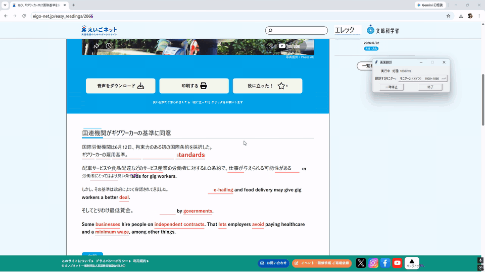

# Screen Translator — 画面オーバーレイ翻訳ツール

画面に表示された英語を、その場に日本語を重ねて自動翻訳する常駐型オーバーレイツールです。ゲーム・海外ツール・英語ドキュメントなど、あらゆるアプリの上で動作します。



## 特徴

- **リアルタイム画面翻訳** — 画面上の英語テキストを検出し、その位置に日本語を重ねて表示。ウィンドウはクリック透過なので、翻訳を表示したまま下のアプリを普通に操作できます
- **GPU アクセラレーション (DirectML)** — OCR は RapidOCR + onnxruntime-directml でローカル GPU 実行。NVIDIA / AMD / Intel いずれの GPU でも動作し、CUDA のセットアップは不要です。GPU が使えない環境では自動的に CPU にフォールバックします
- **フレーム差分による省負荷設計** — 画面が変化していない間は OCR を完全にスキップ。静止画面での CPU 負荷をほぼゼロに抑えます
- **翻訳のちらつき防止機構** — 自分の翻訳表示を再 OCR してしまう無限フィードバックを、画面変化時のみ一瞬だけ表示を消して実画面を撮り直す方式で解決。静止中は表示が消えないため、瞬きが起きません
- **マルチモニタ対応** — 対象モニタを起動引数・設定ファイル・稼働中の操作パネルのいずれからでも切替可能。DPI スケーリングが異なるモニタ構成にも対応(Per-Monitor-V2 DPI aware)

## 動作の仕組み

```
mss で画面キャプチャ
   │
   ├─ 画面に変化なし(64×64 グレースケール差分 < しきい値)→ 何もしない(省負荷)
   │
   └─ 変化あり → 翻訳表示を一瞬消して実画面を再キャプチャ
                    │
                    ▼
              RapidOCR (DirectML GPU) で英語テキストと座標を検出
                    │
                    ▼
              Google 翻訳 (deep-translator) で日本語化 ※結果はキャッシュ
                    │
                    ▼
              tkinter の透明・最前面・クリック透過ウィンドウに描画
```

**処理の所在について:** OCR(文字認識)は完全にローカルの GPU/CPU で実行されます。翻訳は Google 翻訳を利用するため**インターネット接続が必要**です。画面のスクリーンショット自体が外部送信されることはなく、送信されるのは OCR で抽出されたテキストのみです。

## 動作環境

- Windows 10 / 11 (Win32 API と DirectML を使用するため Windows 専用)
- Python 3.11 以上
- GPU 実行には DirectX 12 対応 GPU(無くても CPU で動作)

## インストール

```powershell
git clone https://github.com/<your-name>/screen-translator.git
cd screen-translator
python -m venv .venv
.venv\Scripts\activate
pip install -r requirements.txt
```

**GPU (DirectML) を使う場合は、続けて以下を実行してください(重要):**

```powershell
pip uninstall -y onnxruntime
pip install onnxruntime-directml==1.24.4
```

> rapidocr-onnxruntime が依存として CPU 版 onnxruntime を導入することがあり、
> GPU 版 (onnxruntime-directml) と衝突するためです。CPU のみで使う場合はこの手順は不要です。

## 使い方

```powershell
python screen_translator.py                # メインモニタを翻訳
python screen_translator.py --monitor 2    # 2番目のモニタを翻訳
python screen_translator.py --interval 800 # 更新間隔を800msに
python screen_translator.py --no-use-dml   # GPUを使わずCPUで実行
```

起動すると小さな操作パネルが表示され、一時停止 / 再開 / 終了 / モニタ切替ができます。

## 設定 (config.json)

スクリプトと同じフォルダの `config.json` で既定値を変更できます(無くても動作します)。
優先順位: **コマンドライン引数 > config.json > 組み込み既定値**

| キー | 既定値 | 説明 |
|---|---|---|
| `monitor` | `null` | 対象モニタ番号(1〜)。`null` でメインモニタ |
| `interval` | `1000` | 画面チェックの間隔(ミリ秒) |
| `min_conf` | `0.5` | OCR 信頼度の下限(0〜1)。上げると誤検出が減り、拾い漏れが増える |
| `diff_threshold` | `3.0` | 画面変化の検出しきい値。`0` で常に OCR |
| `use_dml` | `true` | OCR を DirectML(GPU) で実行 |
| `font` | `"Yu Gothic UI"` | オーバーレイのフォント |
| `source_lang` | `"en"` | 翻訳元言語(Google 翻訳の言語コード) |
| `target_lang` | `"ja"` | 翻訳先言語(同上) |

## 既知の制限

- **翻訳元はラテン文字の言語のみ** — 画面上のテキスト検出フィルタがラテン文字主体の行を対象とするため、`source_lang` を変更しても中国語・韓国語などの非ラテン文字言語は翻訳対象になりません
- **翻訳にはネット接続が必要** — オフライン環境では OCR まで動作し、原文がそのまま表示されます
- **Windows 専用** — オーバーレイのクリック透過に Win32 API を使用しているため、macOS / Linux では動作しません

## 技術スタック

| 役割 | 技術 |
|---|---|
| 画面キャプチャ | [mss](https://github.com/BoboTiG/python-mss) |
| OCR | [RapidOCR](https://github.com/RapidAI/RapidOCR) + onnxruntime-directml |
| 翻訳 | [deep-translator](https://github.com/nidhaloff/deep-translator) (Google 翻訳) |
| オーバーレイ | tkinter + Win32 API (レイヤード・クリック透過ウィンドウ) |
| 差分検出 | numpy のみ(64×64 グレースケール平均絶対差) |

## ライセンス

MIT License
